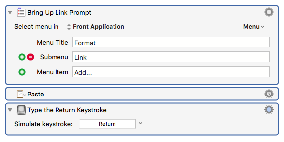
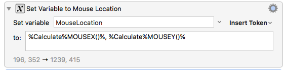
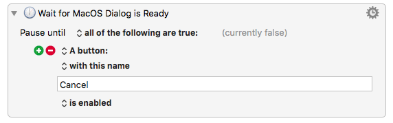
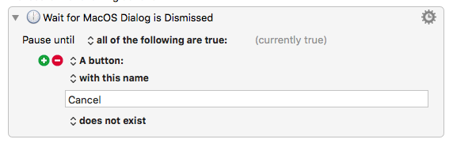

# General Use Macros

### Evernote Specific

#### Evernote Paste Link With Text - Simple

Brings up the link prompt and pastes in your system clipboard contents, then closes the prompt.

# Modular Macros

These are not meant as standalone macros. They're to be kept in a collection called something like "Custom Actions" and then summoned in your other macros with the `Execute Macro` action.

I would add them as plugin actions if I knew how to do that...

## Set MouseLocation

This action sets a varialbe called "MouseLocation" to...the current mouse location.

Pair this with the `Use Variable` action with the option `to set the mouse location` option.

## Wait for Dialogs: Ready and Dismissed

Many macros will get derailed when they get ahead of themselves while waiting for the MacOS save dialog to unfurl itself over the eternity of 500 miliseconds.

Both rely on the state of the `Cancel` button. Every dialog should have a `Cancel` button, so this seems prudent.

### Wait for Dialog is Ready

### Wait for Dialog is Dismissed

